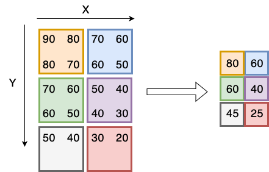

Nous avons réalisé des mesures de puissance de signaux de routeurs WiFi à intervales réguliers sur une grande surface rectangulaire pour produire une carte de densité de puissance à 2 dimensions. 

Le code ci-dessous définit une structure `Routeur`, qui contient un attribut `intensite_signal` destiné à stocker les puissances individuelles mesurées à chaque emplacement.

La carte des mesures à stockées dans un type `Reseau` à définir par vos soins comme un alias de `std::vector` de `std::vector` de `Routeur`. 

La fonction `consolider_signal`, à écrire par vos soins, doit consolider les mesures de puissance en moyennant les valeurs d'intensité de signal de chaque groupe de quatre mesures adjacentes pour former une seule mesure dans une nouvelle carte. 
La réduction se fait donc de moitié en hauteur et en largeur par rapport à la carte originale, comme le montre l'illustration. Notez qu'au bord du réseau, il est possible que la moyenne utilise moins de 4 mesures. 

routers.png

Votre mission consiste donc à déclarer l'alias de type `Reseau` et à définir la fonction `consolider_signal`.

### Code à compléter

~~~cpp
#include <iostream>
#include <vector>

struct Routeur {
    int intensiteSignal; // Intensité du signal du routeur
};

#include "reponse.cpp"      // votre réponse

int main() {
    Reseau reseau = {
            {{90}, {80}, {70}, {60}},
            {{80}, {70}, {60}, {50}},
            {{70}, {60}, {50}, {40}},
            {{60}, {50}, {40}, {30}},
            {{50}, {40}, {30}, {20}}
    };

    Reseau nouveauReseau = consoliderSignal(reseau);

    // Imprimer le nouveau réseau
    for (size_t i = 0; i < nouveauReseau.size(); i++) {
        for (size_t j = 0; j < nouveauReseau[i].size(); j++) {
            std::cout << nouveauReseau[i][j].intensiteSignal << " ";
        }
        std::cout << std::endl;
    }
    return 0;
}
~~~

Reponse

~~~cpp
using Reseau = std::vector<std::vector<Routeur>>;

Reseau consoliderSignal(const Reseau& reseau) {
    Reseau nouveauReseau;

    // Itération sur les lignes du réseau par pas de 2
    for (size_t i = 0; i < reseau.size(); i += 2) {
        std::vector<Routeur> nouvelleLigne;

        // Itération sur les colonnes du réseau par pas de 2
        for (size_t j = 0; j < reseau[i].size(); j += 2) {
            int totalSignal = reseau[i][j].intensiteSignal;
            int compteur = 1;

            // Vérifier les limites et ajouter l'intensité du signal adjacent
            if (j + 1 < reseau[i].size()) {
                totalSignal += reseau[i][j + 1].intensiteSignal;
                compteur++;
            }
            if (i + 1 < reseau.size()) {
                totalSignal += reseau[i + 1][j].intensiteSignal;
                compteur++;
                if (j + 1 < reseau[i + 1].size()) {
                    totalSignal += reseau[i + 1][j + 1].intensiteSignal;
                    compteur++;
                }
            }

            // Calculer la moyenne de l'intensité du signal
            int moyenneSignal = totalSignal / compteur;
            nouvelleLigne.push_back({moyenneSignal});
        }

        // Ajouter la nouvelle ligne au nouveau réseau
        nouveauReseau.push_back(nouvelleLigne);
    }

    return nouveauReseau;
}
~~~

